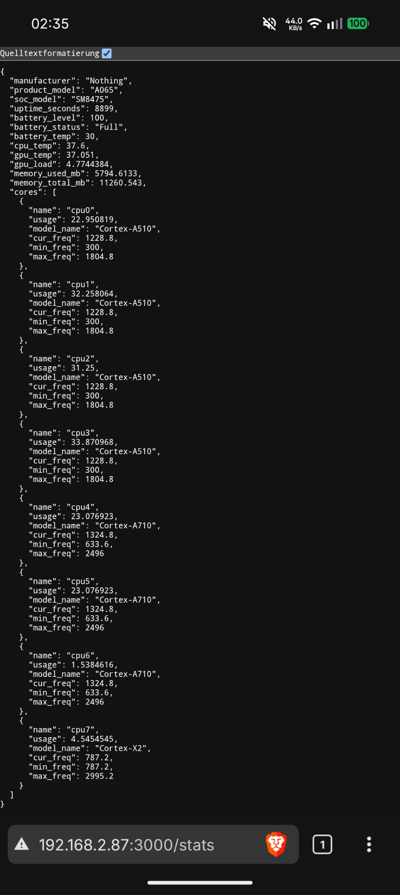

# Asmo

A lightweight REST API server that exposes real-time Android device stats over HTTP — built in Rust for [Termux](https://termux.dev).

Asmo polls hardware telemetry every 500 ms via [Shizuku](https://shizuku.rikka.app/) (`rish`) and serves it as a clean JSON API. Every metric has its own endpoint — query everything at once, or drill into exactly the data you need.

## What it reports

| Category | Fields | Source | Refresh |
|---|---|---|---|
| **Device** | Manufacturer, product model, SoC model | `getprop` | Static |
| **System** | Kernel version, Android version, uptime | `uname -r` / `getprop` | Static / 500ms |
| **Memory** | Used / total, swap used / total | `/proc/meminfo` | 500ms |
| **Thermal** | CPU temperature, GPU temperature | sysfs thermal zones | 500ms |
| **Battery** | Level, status, temperature | `dumpsys battery` via rish | 500ms |
| **GPU** | Load percentage | sysfs kgsl | 500ms |
| **Network** | TX MB, RX MB (cumulative) | `/proc/net/dev` via rish | 500ms |
| **Storage** | Free / total GB | `statvfs("/data")` | 30s |
| **Display** | Refresh rate, brightness | `dumpsys display` via rish | 500ms |
| **Per-core CPU** | Usage %, current / min / max frequency, model name | sysfs / `/proc/stat` | 500ms |

## API Reference

All endpoints use **GET** requests.

### Discovery

| Endpoint | Description |
|---|---|
| `/` | API index — lists every available endpoint |
| `/stats` | Full system stats snapshot |

### Single fields

Every top-level field in the stats is its own endpoint:

| Endpoint | Returns |
|---|---|
| `/manufacturer` | `{"manufacturer": "Nothing"}` |
| `/product_model` | `{"product_model": "A065"}` |
| `/soc_model` | `{"soc_model": "SM8475"}` |
| `/kernel_version` | `{"kernel_version": "5.10.198-..."}` |
| `/android_version` | `{"android_version": "15"}` |
| `/uptime_seconds` | `{"uptime_seconds": 8928}` |
| `/battery_level` | `{"battery_level": 100}` |
| `/battery_status` | `{"battery_status": "Full"}` |
| `/battery_temp` | `{"battery_temp": 31.0}` |
| `/cpu_temp` | `{"cpu_temp": 34.4}` |
| `/gpu_temp` | `{"gpu_temp": 34.098}` |
| `/gpu_load` | `{"gpu_load": 5.27}` |
| `/memory_used_mb` | `{"memory_used_mb": 5585.789}` |
| `/memory_total_mb` | `{"memory_total_mb": 11260.543}` |
| `/swap_used_mb` | `{"swap_used_mb": 2418.5}` |
| `/swap_total_mb` | `{"swap_total_mb": 4096.0}` |
| `/tx_bytes_mb` | `{"tx_bytes_mb": 3639.7}` |
| `/rx_bytes_mb` | `{"rx_bytes_mb": 113700.5}` |
| `/storage_free_gb` | `{"storage_free_gb": 84.3}` |
| `/storage_total_gb` | `{"storage_total_gb": 236.1}` |
| `/refresh_rate` | `{"refresh_rate": 120.0}` |
| `/brightness` | `{"brightness": 0.212}` |

### Per-core CPU

| Endpoint | Description |
|---|---|
| `/cores` | All cores (full array) |
| `/cores/cpu0` | Full snapshot of core 0 |
| `/cores/cpu0/usage` | `{"usage": 28.57}` |
| `/cores/cpu0/model_name` | `{"model_name": "Cortex-A510"}` |
| `/cores/cpu0/cur_freq` | `{"cur_freq": 1804.8}` |
| `/cores/cpu0/min_freq` | `{"min_freq": 300.0}` |
| `/cores/cpu0/max_freq` | `{"max_freq": 1804.8}` |

> Replace `cpu0` with any core name (`cpu1`, `cpu2`, … `cpu7`, etc.).

### Multi-field queries

Combine fields with commas to fetch multiple values in one request. **Fields are returned in the order you specify:**

| Endpoint | Returns |
|---|---|
| `/battery_level,battery_status` | `{"battery_level": 100, "battery_status": "Full"}` |
| `/cpu_temp,gpu_temp,gpu_load` | `{"cpu_temp": 34.4, "gpu_temp": 34.1, "gpu_load": 5.27}` |
| `/manufacturer,product_model,soc_model` | `{"manufacturer": "Nothing", "product_model": "A065", "soc_model": "SM8475"}` |
| `/cores/cpu0/usage,cur_freq` | `{"usage": 28.57, "cur_freq": 1804.8}` |
| `/cores/cpu0/usage,name,model_name` | `{"usage": 28.57, "name": "cpu0", "model_name": "Cortex-A510"}` |

> Works at any level — top-level fields, or fields within a specific core.

### Wildcards

Use `*` or `all` to query a field from **every** item in an array. Each result includes the core's `name` for identification:

| Endpoint | Description |
|---|---|
| `/cores/*/usage` | Usage of every core |
| `/cores/all/usage` | Same — shell-friendly alias for `*` |
| `/cores/*/usage,cur_freq` | Usage + frequency of every core |
| `/cores/all/cur_freq,model_name` | Frequency + model of every core |

> **Shell note:** `*` requires quoting in shell: `curl -s 'localhost:3000/cores/*/usage'`
> `all` needs no quoting: `curl -s localhost:3000/cores/all/usage`

### Dynamic routing

Endpoints are **generated automatically** from the data structure. If a new field is added to the stats in code, it becomes a reachable endpoint immediately — no routing changes required.

### Error responses

Unknown paths return `404` with a helpful JSON body:

```json
{
  "error": "not found",
  "path": "/nonexistent",
  "hint": "GET / for available endpoints"
}
```

### Design note: scope of comma queries

Comma-separated fields work within a **single path level** — for example `/battery_level,cpu_temp` (top-level) or `/cores/cpu0/usage,cur_freq` (within a core). Mixing different path depths (like `/gpu_load,cores/all/usage`) is not possible because `/` is the HTTP path separator, meaning the server would interpret it as nested segments rather than separate fields.

For mixed-depth queries, use `/stats` with jq:

```sh
curl -s localhost:3000/stats | jq '{gpu_load, cores: [.cores[] | {name, usage}]}'
```

<details>
<summary>Full /stats response example</summary>

```json
{
  "manufacturer": "Nothing",
  "product_model": "A065",
  "soc_model": "SM8475",
  "kernel_version": "5.10.198-...",
  "android_version": "15",
  "uptime_seconds": 8928,
  "battery_level": 100,
  "battery_status": "Full",
  "battery_temp": 31,
  "cpu_temp": 34.4,
  "gpu_temp": 34.098,
  "gpu_load": 5.2692976,
  "memory_used_mb": 5585.789,
  "memory_total_mb": 11260.543,
  "swap_used_mb": 2418.5,
  "swap_total_mb": 4096.0,
  "tx_bytes_mb": 3639.7,
  "rx_bytes_mb": 113700.5,
  "storage_free_gb": 84.3,
  "storage_total_gb": 236.1,
  "refresh_rate": 120.0,
  "brightness": 0.212,
  "cores": [
    {
      "name": "cpu0",
      "usage": 28.57143,
      "model_name": "Cortex-A510",
      "cur_freq": 1804.8,
      "min_freq": 300,
      "max_freq": 1804.8
    },
    {
      "name": "cpu1",
      "usage": 28.57143,
      "model_name": "Cortex-A510",
      "cur_freq": 1440,
      "min_freq": 300,
      "max_freq": 1804.8
    },
    {
      "name": "cpu2",
      "usage": 26.984129,
      "model_name": "Cortex-A510",
      "cur_freq": 1440,
      "min_freq": 300,
      "max_freq": 1804.8
    },
    {
      "name": "cpu3",
      "usage": 31.746033,
      "model_name": "Cortex-A510",
      "cur_freq": 1440,
      "min_freq": 300,
      "max_freq": 1804.8
    },
    {
      "name": "cpu4",
      "usage": 9.230769,
      "model_name": "Cortex-A710",
      "cur_freq": 1766.4,
      "min_freq": 633.6,
      "max_freq": 2496
    },
    {
      "name": "cpu5",
      "usage": 23.188406,
      "model_name": "Cortex-A710",
      "cur_freq": 1881.6,
      "min_freq": 633.6,
      "max_freq": 2496
    },
    {
      "name": "cpu6",
      "usage": 10.769231,
      "model_name": "Cortex-A710",
      "cur_freq": 1881.6,
      "min_freq": 633.6,
      "max_freq": 2496
    },
    {
      "name": "cpu7",
      "usage": 0,
      "model_name": "Cortex-X2",
      "cur_freq": 2476.8,
      "min_freq": 787.2,
      "max_freq": 2995.2
    }
  ]
}
```



</details>

## Prerequisites

- [Termux](https://termux.dev) installed
- [Shizuku](https://shizuku.rikka.app/) running (provides `rish` for privileged sysfs access)

## Build from source

```sh
# Update packages
yes | pkg up

# Install dependencies
pkg install git rust -y

# Clone the repo
git clone https://github.com/theonuverse/asmo.git
cd asmo

# Build
cargo build --release

# Install into Termux PATH
cp target/release/asmo $PREFIX/bin/
```

> **Tip:** If you just want to test without installing, run `cargo run --release` from the project directory.

## Usage

```sh
asmo
```

```
🚀 Asmo running on: http://192.168.1.42:3000
   GET / for all available endpoints
```

Open the printed URL from any device on the same network.

## Examples

### Discover all endpoints

```sh
curl -s localhost:3000/ | jq .
```

### Full stats

```sh
curl -s localhost:3000/stats | jq .
```

### Single fields

```sh
curl -s localhost:3000/battery_level
# → {"battery_level":100}

curl -s localhost:3000/gpu_load
# → {"gpu_load":5.27}

curl -s localhost:3000/cpu_temp
# → {"cpu_temp":34.4}
```

### Multiple fields at once

Fields are returned in the order you specify.

```sh
# Your order: usage first, then name, then model
curl -s localhost:3000/cores/cpu0/usage,name,model_name | jq .
# → {"usage":28.57,"name":"cpu0","model_name":"Cortex-A510"}

# Device identity
curl -s localhost:3000/manufacturer,product_model,soc_model | jq .
# → {"manufacturer":"Nothing","product_model":"A065","soc_model":"SM8475"}

# Thermal overview
curl -s localhost:3000/cpu_temp,gpu_temp,gpu_load | jq .
# → {"cpu_temp":34.4,"gpu_temp":34.1,"gpu_load":5.27}

# Battery summary
curl -s localhost:3000/battery_level,battery_status,battery_temp | jq .
# → {"battery_level":100,"battery_status":"Full","battery_temp":31.0}
```

### Per-core CPU data

```sh
# Full snapshot of cpu0
curl -s localhost:3000/cores/cpu0 | jq .

# Just the usage of cpu0
curl -s localhost:3000/cores/cpu0/usage
# → {"usage":28.57}

# Current frequency of cpu4
curl -s localhost:3000/cores/cpu4/cur_freq
# → {"cur_freq":1766.4}
```

### Wildcard queries

```sh
# Usage of every core (* requires quoting in shell)
curl -s 'localhost:3000/cores/*/usage' | jq .
```

```json
[
  {"name": "cpu0", "usage": 28.57},
  {"name": "cpu1", "usage": 14.29},
  {"name": "cpu2", "usage": 26.98},
  "..."
]
```

```sh
# Shell-friendly alternative — no quoting needed
curl -s localhost:3000/cores/all/usage | jq .

# Multiple fields from every core — your field order is preserved
curl -s localhost:3000/cores/all/usage,cur_freq,model_name | jq .
```

```json
[
  {"name": "cpu0", "usage": 28.57, "cur_freq": 1804.8, "model_name": "Cortex-A510"},
  {"name": "cpu1", "usage": 14.29, "cur_freq": 1440.0, "model_name": "Cortex-A510"},
  "..."
]
```

### Monitor continuously

```sh
# Poll battery every 2 seconds
watch -n2 'curl -s localhost:3000/battery_level'

# Poll GPU load + temps
watch -n2 'curl -s localhost:3000/cpu_temp,gpu_temp,gpu_load'
```

### Scripting / piping

```sh
# Log battery level to a file
while true; do curl -s localhost:3000/battery_level >> battery.jsonl; sleep 5; done

# Get all core usages in one line
for i in $(seq 0 7); do
  echo -n "cpu$i: "
  curl -s localhost:3000/cores/cpu$i/usage | jq -r '.usage'
done
```

### Integration

The API is stateless and side-effect-free — pipe the JSON into `jq`, `awk`, `gnuplot`, Grafana, Home Assistant, Discord webhooks, or anything else that consumes JSON.

## Architecture

```
main.rs        → Entrypoint — binds the HTTP server (Axum) on port 3000
router.rs      → Dynamic router — resolves any URL path to a stats field at runtime
discover.rs    → One-shot device probe at startup (thermal zones, core topology, SoC identity)
monitor.rs     → Async polling loop — sysfs reads + rish for privileged data (battery, uptime, /proc/stat, network, display)
types.rs       → Shared data structures (zero-copy Arc<str> strings, typed BatteryStatus enum)
```

### How dynamic routing works

1. `SystemStats` is serialized into a `serde_json::Value` tree on each request.
2. The URL path (`/cores/cpu0/usage`) is split into segments: `["cores", "cpu0", "usage"]`.
3. Each segment navigates one level deeper — object fields by key, array items by `"name"`, wildcards (`*`/`all`) expand over all array items.
4. Comma-separated last segments resolve multiple fields, preserving your specified order.
5. The resolved value is returned as JSON.

This means **any new field** added to `SystemStats` (or its nested structs) is instantly available as an endpoint — no manual route registration, no boilerplate.

## License

[MIT](LICENSE)
